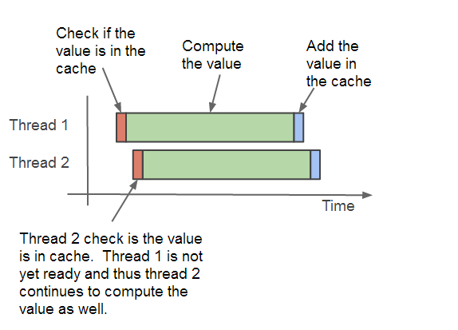
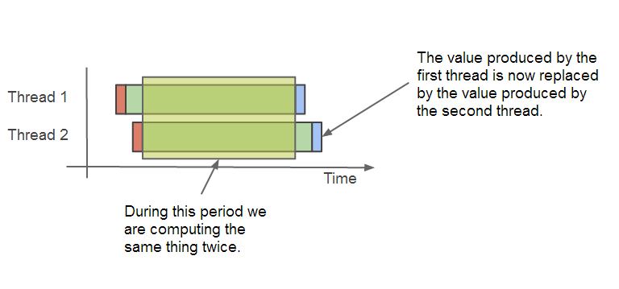
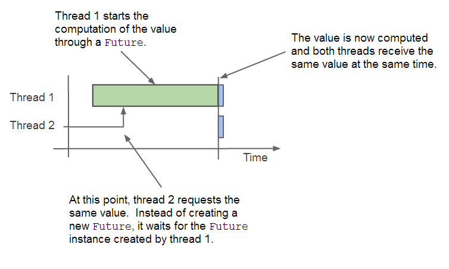

Albert Einstein ([Wiki](http://en.wikipedia.org/wiki/Albert_Einstein)) defines _insanity_ as follows:

> Insanity: doing the same thing over and over again and expecting different results ([reference](http://www.brainyquote.com/quotes/quotes/a/alberteins133991.html))

In programming we can avoid _insanity_ by using caching.  Caching, together with avoiding insanity, can boost performance as we do not have to compute complex algorithms again and again.  Instead we simply use the previously computed values.  Caching saves time by using more memory.  Instead of computing something again, the result obtained before is saved in memory and retrieved from memory next time required.  Large cache deposits will require more space, and since memory is a finite resource we cannot cache everything.  We should choose what we cache with care.

In this article we will see how to implement a good, thread-safe caching algorithm that can help boosting the performance.  If you are interested in Spring caching, please refer to another article called: _Caching Made Easy with Spring_ ([Article](http://www.javacreed.com/caching-made-easy-with-spring/)).

All code listed below is available at: [https://github.com/javacreed/how-to-cache-results-to-boost-performance](https://github.com/javacreed/how-to-cache-results-to-boost-performance).  Most of the examples will not contain the whole code and may omit fragments which are not relevant to the example being discussed. The readers can download or view all code from the above link.

## Naive Implementation

A naive caching algorithm will take the following form

```
IF value in cached THEN
  return value from cache
ELSE
  compute value
  save value in cache
  return value
END IF  
```

The above algorithm is the simplest form of caching algorithm.  Let us apply the above algorithm to a simple example.  For this example we will use the Fibonacci number sequence ([Wiki](http://en.wikipedia.org/wiki/Fibonacci_number)).  The Fibonacci number sequence is a good candidate for caching as the _n_<sup>th</sup> number is equal to the sum of the previous two numbers in the sequence.  Therefore, if you need the _n_<sup>th</sup> Fibonacci number in the sequence, you have to first compute the (_n_<sup>th</sup> - 1) and (_n_<sup>th</sup> - 2) Fibonacci numbers, and so on and so forth until you reach the base case.

```java
package com.javacreed.examples.cache.part1;

import java.util.HashMap;
import java.util.Map;

public class NaiveCacheExample {

  private Map<Long, Long> cache = new HashMap<>();

  public NaiveCacheExample() {
    /* The base case for the Fibonacci Sequence */
    cache.put(0L, 1L);
    cache.put(1L, 1L);
  }

  public Long getNumber(long index) {
    /* Check if value is in cache */
    if (cache.containsKey(index)) {
      return cache.get(index);
    }

    /* Compute value and save it in cache */
    long value = getNumber(index - 1) + getNumber(index - 2);
    cache.put(index, value);
    return value;
  }
}
```

The example shown above, caches the values in a `Map` ([Java Doc](http://docs.oracle.com/javase/7/docs/api/java/util/Map.html)), where the sequence number acts as the map index (or key).  Furthermore, it also caches the base case values rather than adds checks in the `getNumber()` method.  This approach works well for this problem but has the following shortcomings:

1. **This approach is not thread-safe**

    This problem can be mitigated by using a concurrent version of the `Map`, such as `ConcurrentMap` ([Java Doc](http://docs.oracle.com/javase/7/docs/api/java/util/concurrent/ConcurrentMap.html)).  Alternatively, you can guard the access to the map by using locks ([Article](http://www.javacreed.com/understanding-threads-monitors-and-locks/)) but the other approach is preferred as it scales better.

1. **The same value can be computed more than once**

    Say that two threads need to retrieve the same Fibonacci number which is not in cache.  Using this approach, both threads will end up computing the same value.  Thus the same value ends up being computed twice.  The following image captures this problem.

    

    This problem not only it defeats the caching purpose, but duplicates the computational power required (or slows the end result as the machine throughput is halved) as shown in the following image.

    

    This problem may seem mild but it can have serious implications to both memory and CPU resources.  Note that the purpose of using caching is to reduce the computations by retrieving the result from cache.

1. **The design cannot be used to cache several different values from other algorithms**

    The caching algorithm is hard-coded to work with a single algorithm, that is, the Fibonacci sequence generator.  The method `getNumber()` managed the cache and also computes the value.  Using this approach, we cannot have one without the other.  

    ```java
    package com.javacreed.examples.cache.part1;

    import java.util.HashMap;
    import java.util.Map;

    public class NaiveCacheExample {

      private Map<Long, Long> cache = new HashMap<>();

      public NaiveCacheExample() {
        /* The base case for the Fibonacci Sequence */
        cache.put(0L, 1L);
        cache.put(1L, 1L);
      }

      public Long getNumber(long index) {
        /* Check if value is in cache */
        if (cache.containsKey(index)) {
          return cache.get(index);
        }

        /* Compute value and save it in cache */
        long value = getNumber(index - 1) + getNumber(index - 2);
        cache.put(index, value);
        return value;
      }
    }
    ```

    Say we need to use the cache for something else, such as determining whether a large number is a prime number ([Wiki](http://en.wikipedia.org/wiki/Prime_number)) or not, we need to write both the caching function and the algorithm that computes it.  Therefore, we need to rewrite the caching code in every class/problem we have and need to use caching.


A better version of the caching algorithm can be written using `Callable` ([Java Doc](http://docs.oracle.com/javase/7/docs/api/java/util/concurrent/Callable.html)) and `Future` ([Java Doc](http://docs.oracle.com/javase/7/docs/api/java/util/concurrent/Future.html)).  As already mentioned, the cached values will be stored within an instance of `ConcurrentMap`.  These three classes can mitigate the shortcomings listed above.

1. The `ConcurrentMap`'s `putIfAbsent()` ([Java Doc](http://docs.oracle.com/javase/7/docs/api/java/util/concurrent/ConcurrentMap.html#putIfAbsent(K,%20V))) method will only add a value to the map if one does not exists in a thread-safe manner.  This map can be accessed by multiple threads in a safe way.

1. The `Future`'s `get()` ([Java Doc](http://docs.oracle.com/javase/7/docs/api/java/util/concurrent/Future.html#get())) method is guaranteed to be executed only once even if the second thread requests the value while the first thread is computing it.

1. Finally, the algorithm is moved into an instance of `Callable`.  Thus we can use this approach to cache anything we need.  All we need to do is to wrap the algorithm within an instance of `Callable`.  Using this approach we can use the same caching algorithm by different problems.

Let's start building all this.

## Thread-safe Generic Cache Algorithm

Three changes are required to convert our naive implementation to a thread-safe, generic cache algorithm.  The caching class needs to be thread-safe and needs to smart enough to prevent the computation of the same value twice even is the first thread has not yet finished yet.  The second thread should still use the value being calculated by the first thread.  We also need to move the Fibonacci related code outside from the caching class.  Since our new approach has to be generic, we will use Generics ([Tutorial](http://docs.oracle.com/javase/tutorial/java/generics/)) to support type checking even when used for different scenarios.

Following is the new caching algorithm.

```java
package com.javacreed.examples.cache.part2;

import java.util.concurrent.Callable;
import java.util.concurrent.ConcurrentHashMap;
import java.util.concurrent.ConcurrentMap;
import java.util.concurrent.ExecutionException;
import java.util.concurrent.Future;
import java.util.concurrent.FutureTask;

public class GenericCacheExample<K, V> {

  private final ConcurrentMap<K, Future<V>> cache = new ConcurrentHashMap<>();

  private Future<V> createFutureIfAbsent(final K key, final Callable<V> callable) {
    Future<V> future = cache.get(key);
    if (future == null) {
      final FutureTask<V> futureTask = new FutureTask<>(callable);
      future = cache.putIfAbsent(key, futureTask);
      if (future == null) {
        future = futureTask;
        futureTask.run();
      }
    }
    return future;
  }

  public V getValue(final K key, final Callable<V> callable) throws InterruptedException, ExecutionException {
    try {
      final Future<V> future = createFutureIfAbsent(key, callable);
      return future.get();
    } catch (InterruptedException | ExecutionException | RuntimeException e) {
      cache.remove(key);
      throw e;
    }
  }

  public void setValueIfAbsent(final K key, final V value) {
    createFutureIfAbsent(key, new Callable<V>() {
      @Override
      public V call() throws Exception {
        return value;
      }
    });
  }
}
```

This class is less than 55 lines of code and meets all our requirements as explained next.  Like any other problem, let's break this one into smaller pieces and understand each piece first.  Then we will put it all together.

1. The class makes use of generics.  `K` is the type representing the key, `Long` in the Fibonacci example, where `V` represents type of the value that will be returned.  This is too `Long` in the Fibonacci example.

    ```java
    public class GenericCacheExample<K, V> {
    ```

1. The cache is now saved in a `ConcurrentMap` instead of a `Map`.  Furthermore, the field `cache` does not hold the value but an instance of `Future`.  This is a very important change as this prevents the same value from being computed twice (even when the first value is still being computed).

    ```java
      private ConcurrentMap<K, Future<V>> cache = new ConcurrentHashMap<>();
    ```

    The `Future` represents the code that will compute and return the value.  There will be only one future for any given key (as we will see later on).  When thread 1 adds the `Future` instance to the cache, thread 2 will obtain the same `Future` instance and will both wait for this to finish.

    

     This solves the second problem but we still need to make sure that only one instance of `Future` is added to the `cache` field.

1. We need to make sure that only one `Future` is added to the `cache` irrespective of the number of threads using it.  The following code fragment is responsible from this.

    ```java
      private Future<V> createFutureIfAbsent(final K key, final Callable<V> callable) {
        Future<V> future = cache.get(key);
        if (future == null) {
          final FutureTask<V> futureTask = new FutureTask<V>(callable);
          future = cache.putIfAbsent(key, futureTask);
          if (future == null) {
            future = futureTask;
            futureTask.run();
          }
        }
        return future;
      }
    ```

    This code may not be as straightforward as one would hope, so we will break this further.

    1.1. First we try to obtain the `Future` from the `cache`.

        ```java
            Future<V> future = cache.get(key);
        ```

    1.1. If this is `null`, then we need to create a new instance of `Future` and add it to the cache.

        ```java
              final FutureTask<V> futureTask = new FutureTask<V>(callable);
              future = cache.putIfAbsent(key, futureTask);
        ```

        Here we are using the `putIfAbsent()` method of the `ConcurrentMap` which guarantees to add the given object if and only if no other entry exists for the given key.

    1.1. The `putIfAbsent()` method will return the previous value attached with the given key.  If this is `null` it means that no value was attached with this key and that our `Future` instance was added to the map.

        ```java
              if (future == null) {
                future = futureTask;
                futureTask.run();
              }
        ```

        In this case we have to start the task as otherwise it would never kick off and we will stuck waiting for it forever.  

    It is imperative to only execute the `FutureTask` ([Java Doc](http://docs.oracle.com/javase/7/docs/api/java/util/concurrent/FutureTask.html)) `run()` ([Java Doc](http://docs.oracle.com/javase/7/docs/api/java/util/concurrent/FutureTask.html#run())) method once as otherwise we will have the same value computed several times.  This is the key part in preventing the same value being computed several times.

1. Finally we need to retrieve the value and return it to the caller.  This is achieved through the `Future`'s `get()` method.

    ```java
      public V getValue(final K key, final Callable<V> callable) throws InterruptedException, ExecutionException {
        try {
          final Future<V> future = createFutureIfAbsent(key, callable);
          return future.get();
        } catch (InterruptedException | ExecutionException | RuntimeException e) {
          cache.remove(key);
          throw e;
        }
      }
    ```

    The `get()` may throw an exception should an error occurs while computing the value.  In this case we need to remove this value from the `cache` and re-throw the exception.

1. The `setValueIfAbsent()` method allows the user to add values to the cache if these are not yet added.  This is ideal for cases such as the Fibonacci base case where the values for indices 0 and 1 are both 1.

    ```java
      public void setValueIfAbsent(final K key, final V value) {
        createFutureIfAbsent(key, new Callable<V>() {
          @Override
          public V call() throws Exception {
            return value;
          }
        });
      }
    ```

    Note that while this method takes a value, it must wrap it in a `Callable` and then add it to the `cache` through an instance of `Future`.

With the algorithm explained, let''s now put this into action.  In the following section we will see some examples of how to use the new generic, thread-safe, cache algorithm.


## Using the new cache algorithm

Now that we understand how the caching algorithm works, it is time to turn our attention to explore how we can make good use of this algorithm.  We will analyse two different examples.  We will start with the Fibonacci implementation and see how we can easily use the caching algorithm to save us time from recomputing values that were already computed.  After that we will use the same algorithm for a fictitious task that will take a considerable amount of time to compute (say a couple of seconds).

### Fibonacci Sequence Numbers

The caching algorithm requires two inputs.  The key that uniquely identifies the value in the case and a `Callable` that is able to compute the value should this be found missing in the case.  In order to use the caching algorithm with our Fibonacci problem, we need to convert our example to make use of the new caching algorithm as shown next

```java
package com.javacreed.examples.cache.part2;

import java.util.concurrent.Callable;

import org.slf4j.Logger;
import org.slf4j.LoggerFactory;

public class FibonacciExample {

  private static final Logger LOGGER = LoggerFactory.getLogger(FibonacciExample.class);

  public static void main(final String[] args) throws Exception {
    final long index = 12;
    final FibonacciExample example = new FibonacciExample();
    final long fn = example.getNumber(index);
    FibonacciExample.LOGGER.debug("The {}th Fibonacci number is: {}", index, fn);
  }

  private final GenericCacheExample<Long, Long> cache = new GenericCacheExample<>();

  public FibonacciExample() {
    cache.setValueIfAbsent(0L, 1L);
    cache.setValueIfAbsent(1L, 1L);
  }

  public long getNumber(final long index) throws Exception {
    return cache.getValue(index, new Callable<Long>() {
      @Override
      public Long call() throws Exception {
        FibonacciExample.LOGGER.debug("Computing the {} Fibonacci number", index);
        return getNumber(index - 1) + getNumber(index - 2);
      }
    });
  }
}
```

As you can see in the above example, the modifications required were minimal.  All caching code is encapsulated within the caching algorithm and our code simple interacts with it.  The caching algorithm is thread-safe and since all the state is saved by the caching algorithm, our class is inherently thread-safe.  Using this new approach, we can have this class (`FibonacciExample`) focusing on its business logic, that is, computing the Fibonacci sequence.

This example included a `main()` method to simplify the demo.  The above class will produce something similar to the follow.

```
00:18:21.913 [main] DEBUG FibonacciExample.java:30 - Computing the 12 Fibonacci number
00:18:21.915 [main] DEBUG FibonacciExample.java:30 - Computing the 11 Fibonacci number
00:18:21.916 [main] DEBUG FibonacciExample.java:30 - Computing the 10 Fibonacci number
00:18:21.917 [main] DEBUG FibonacciExample.java:30 - Computing the 9 Fibonacci number
00:18:21.917 [main] DEBUG FibonacciExample.java:30 - Computing the 8 Fibonacci number
00:18:21.917 [main] DEBUG FibonacciExample.java:30 - Computing the 7 Fibonacci number
00:18:21.917 [main] DEBUG FibonacciExample.java:30 - Computing the 6 Fibonacci number
00:18:21.918 [main] DEBUG FibonacciExample.java:30 - Computing the 5 Fibonacci number
00:18:21.918 [main] DEBUG FibonacciExample.java:30 - Computing the 4 Fibonacci number
00:18:21.918 [main] DEBUG FibonacciExample.java:30 - Computing the 3 Fibonacci number
00:18:21.918 [main] DEBUG FibonacciExample.java:30 - Computing the 2 Fibonacci number
00:18:21.919 [main] DEBUG FibonacciExample.java:16 - The 12th Fibonacci number is: 233
```

As shown in the output, each Fibonacci number is evaluated only once.  All the other times, this was retrieved from the cache.  In the following example we will see how to use the same cache algorithm in another context.

### Fictitious Long Running Task

The caching algorithm is not bound with the Fibonacci sequence or any other class.  On the contrary it can be used in other cases too.  Here we have a fictitious long running task, which we would like to cache.  As shown in the following, example, our caching algorithm can do the trick.

```java
package com.javacreed.examples.cache.part2;

import java.util.concurrent.Callable;

import org.slf4j.Logger;
import org.slf4j.LoggerFactory;
import org.springframework.util.StopWatch;

public class FictitiousLongRunningTask {

  private static final Logger LOGGER = LoggerFactory.getLogger(FictitiousLongRunningTask.class);

  public static void main(final String[] args) throws Exception {
    final FictitiousLongRunningTask task = new FictitiousLongRunningTask();

    final StopWatch stopWatch = new StopWatch("Fictitious Long Running Task");
    stopWatch.start("First Run");
    task.computeLongTask("a");
    stopWatch.stop();

    stopWatch.start("Other Runs");
    for (int i = 0; i < 100; i++) {
      task.computeLongTask("a");
    }
    stopWatch.stop();

    FictitiousLongRunningTask.LOGGER.debug("{}", stopWatch);
  }

  private final GenericCacheExample<String, Long> cache = new GenericCacheExample<>();

  public long computeLongTask(final String key) throws Exception {
    return cache.getValue(key, new Callable<Long>() {
      @Override
      public Long call() throws Exception {
        FictitiousLongRunningTask.LOGGER.debug("Computing Fictitious Long Running Task: {}", key);
        Thread.sleep(10000); // 10 seconds
        return System.currentTimeMillis();
      }
    });
  }
}
```

In this example we made use of the `StopWatch` ([Java Doc](https://docs.spring.io/spring-framework/docs/current/javadoc-api/org/springframework/util/StopWatch.html)) utility class to measure the time it takes to retrieve the items from cache once the first item is computed.

No changes were required to the caching algorithm and implementing is was quite easy.  The above code will produce something similar to the following.

```
00:24:16.086 [main] DEBUG FictitiousLongRunningTask.java:36 - Computing Fictitious Long Running Task: a
00:24:26.089 [main] DEBUG FictitiousLongRunningTask.java:27 - StopWatch 'Fictitious Long Running Task': running time (millis) = 10006; [First Run] took 10005 = 100%; [Other Runs] took 1 = 0%
```

As shown on the output above, once the first value is computed and saved in cache, all other retrievals happened instantly without introducing any noticeable delays.

## Conclusion

Caching is very handy as it can boost the performance of an application.  But when done incorrectly can cripple an application as described in this article.  Spring provides caching as described in the article titled: _Caching Made Easy with Spring_ ([Article](http://www.javacreed.com/caching-made-easy-with-spring/)).  This simplifies caching further as you do not have to worry about the caching algorithm.  With that said, such approach has its limitations as it does not work well with recursion algorithms.
